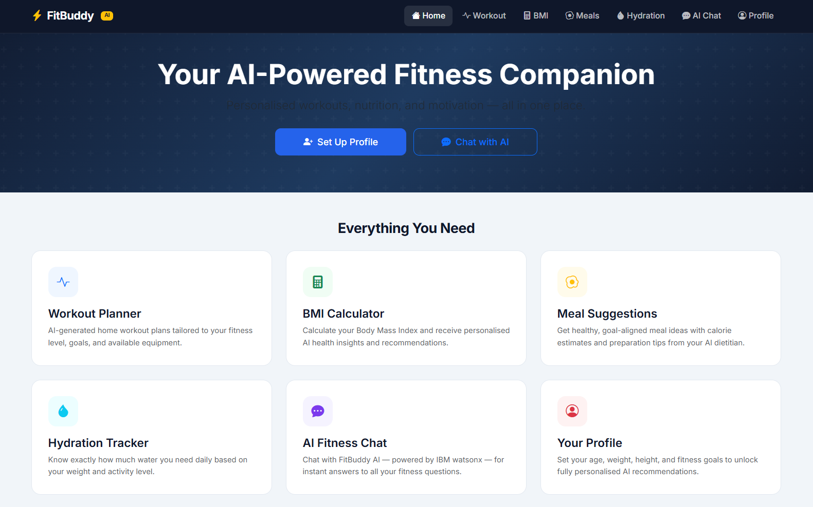
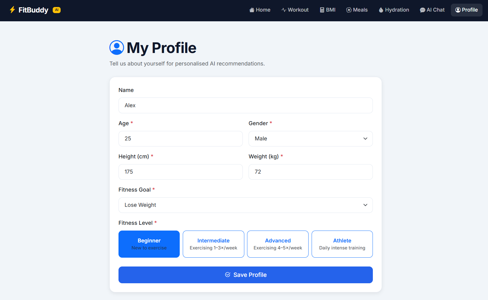
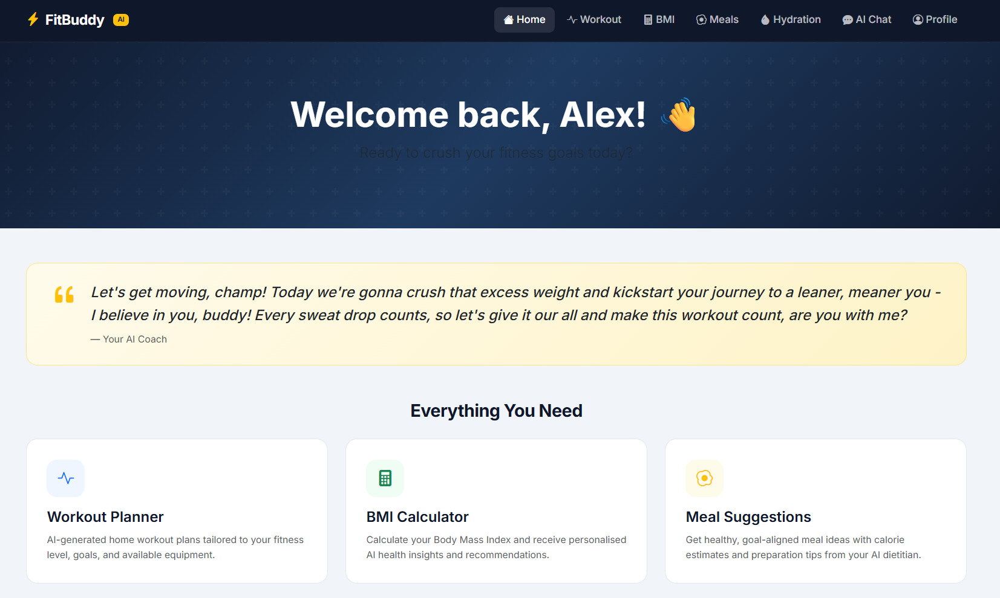
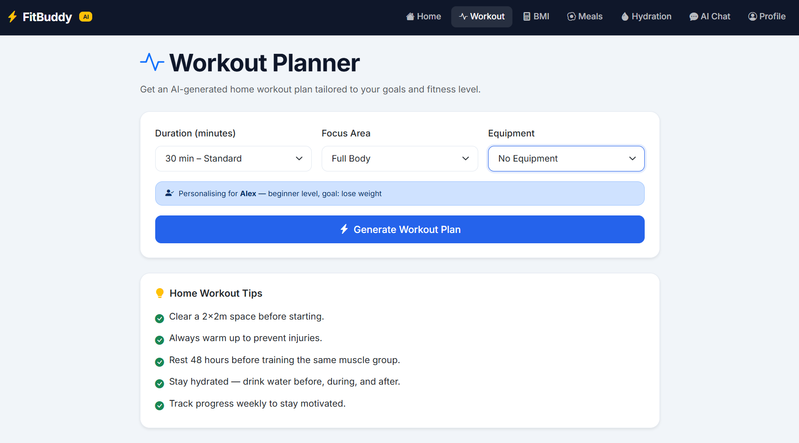
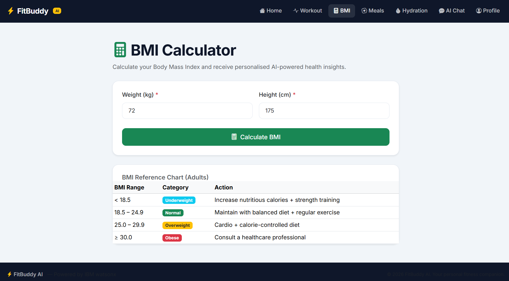
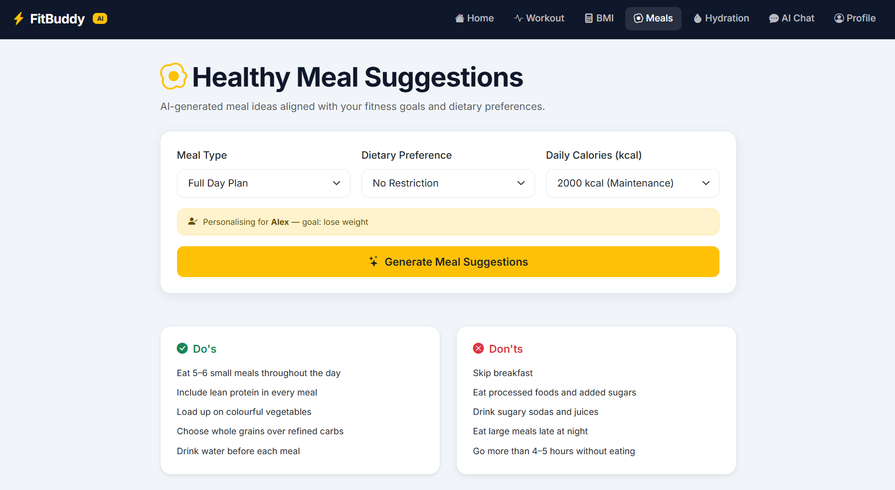
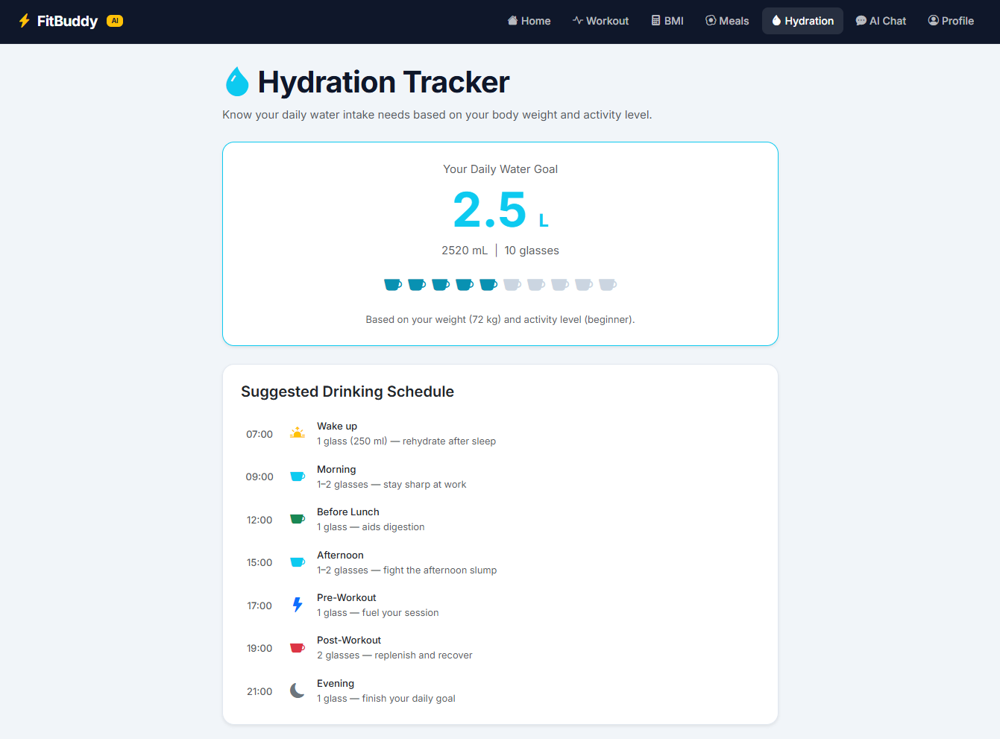
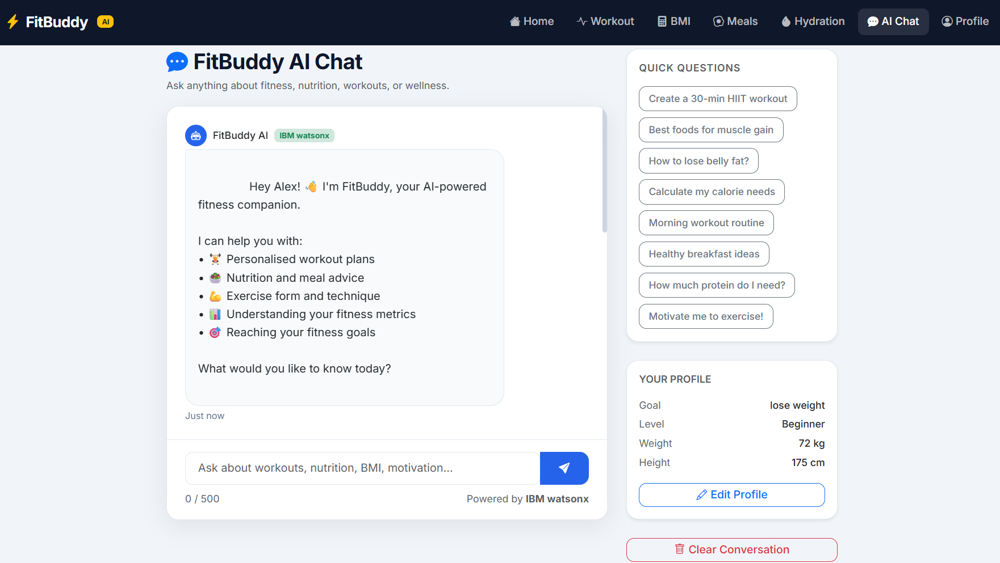

# FitBuddy AI 🏋️‍♂️⚡

An **AI-powered Fitness Companion** web application built with Python Flask and IBM watsonx. FitBuddy delivers personalised workout plans, BMI analysis, healthy meal suggestions, hydration tracking, and real-time fitness chat — all powered by the GPT-OSS 120B (Llama 3.3 70B Instruct) model via IBM watsonx on IBM Cloud Lite.

<p align="center">
  
</p>

---

## 🚀 Live Demo

🌐 **Live Website**

https://fitness-buddy-bue4.onrender.com

> ⚠️ First load may take 30–60 seconds because Render's free tier puts inactive services to sleep.

---

## Features

| Feature | Description |
|---|---|
| **AI Chat** | Real-time conversational interface powered by IBM watsonx |
| **Workout Planner** | Personalised home workout plans (duration, focus area, equipment) |
| **BMI Calculator** | BMI with AI-powered health recommendations |
| **Meal Suggestions** | Goal-aligned meal ideas with dietary preference support |
| **Hydration Tracker** | Daily water intake calculator + drinking schedule |
| **Daily Motivation** | AI-generated motivational messages tailored to your goals |
| **User Profile** | Age, gender, height, weight, fitness goal, and fitness level |
| **Responsive UI** | Bootstrap 5 — mobile-first design |

---

## 🛠️ Tech Stack

- **Backend**: Python 3.11+ / Flask 3.0
- **AI**: IBM watsonx (meta-llama/llama-3-3-70b-instruct — GPT-OSS 120B)
- **Frontend**: Bootstrap 5.3, Bootstrap Icons, Vanilla JavaScript
- **Auth**: IBM Cloud IAM (API key)

---

## 📸 Application Screenshots

### 👤 Profile & 🏠 Home

<p align="center">
  
  
</p>

### 💪 Workout Planner & 📊 BMI Calculator

<p align="center">
  
  
</p>

### 🥗 Meal Suggestions & 💧 Hydration Tracker

<p align="center">
  
  
</p>

### 🤖 AI Chat

<p align="center">
  
</p>

---

## 📋 Prerequisites

- Python 3.11 or higher
- An **IBM Cloud** account (free Lite tier is sufficient)
- A **IBM watsonx.ai** project

---

## ☁️ IBM Cloud & watsonx Setup

1. **Create an IBM Cloud account** at [cloud.ibm.com](https://cloud.ibm.com/) (free Lite tier available).

2. **Provision IBM watsonx.ai**:
   - In IBM Cloud, search for **watsonx.ai** and create a service (select the **Lite** plan).
   - From the watsonx.ai Studio, create a new **project**.
   - Copy the **Project ID** from the project settings.

3. **Create an API Key**:
   - In IBM Cloud, go to **Manage → Access (IAM) → API keys**.
   - Click **Create an IBM Cloud API key** and save the key securely.

4. **Find your regional URL**:
   - Default: `https://us-south.ml.cloud.ibm.com` (Dallas)
   - Other regions: `eu-de` (Frankfurt), `eu-gb` (London), `jp-tok` (Tokyo), `au-syd` (Sydney)

---

## ⚙️ Installation

```bash
# 1. Clone the repository
git clone <your-repo-url>
cd fitnessbuddy

# 2. Create and activate a virtual environment
python -m venv venv

# Windows
venv\Scripts\activate

# macOS / Linux
source venv/bin/activate

# 3. Install dependencies
pip install -r requirements.txt

# 4. Configure environment variables
cp .env.example .env
# Edit .env and fill in your IBM credentials

# 5. Run the application
python app.py
```

The app will be available at **http://localhost:5000**

---

## 🎯 Environment Variables

Copy `.env.example` to `.env` and fill in your values:

```env
# IBM watsonx credentials
WATSONX_API_KEY=your_ibm_cloud_api_key_here
WATSONX_PROJECT_ID=your_watsonx_project_id_here
WATSONX_URL=https://us-south.ml.cloud.ibm.com

# Model — GPT-OSS 120B via IBM watsonx
WATSONX_MODEL_ID=meta-llama/llama-3-3-70b-instruct

# Flask
FLASK_SECRET_KEY=change_this_to_a_random_string
FLASK_DEBUG=False
```

---

## 🚀 Running in Production

Using **Gunicorn** (Linux/macOS):

```bash
gunicorn -w 4 -b 0.0.0.0:5000 app:app
```

Using **Waitress** (Windows):

```bash
pip install waitress
waitress-serve --host=0.0.0.0 --port=5000 app:app
```

---

## 📌 Project Structure

```
fitnessbuddy/
├── app.py                  # Flask application + IBM watsonx integration
├── requirements.txt        # Python dependencies
├── .env.example            # Environment variable template
├── .env                    # Your credentials (never commit this!)
├── README.md
├── templates/
│   ├── base.html           # Base layout (navbar, footer, flash messages)
│   ├── index.html          # Home page + daily motivation + feature cards
│   ├── chat.html           # AI chat interface
│   ├── workout.html        # Home workout planner
│   ├── bmi.html            # BMI calculator
│   ├── meal.html           # Meal suggestions
│   ├── hydration.html      # Hydration tracker
│   ├── profile.html        # User profile form
│   ├── 404.html            # 404 error page
│   └── 500.html            # 500 error page
└── static/
    ├── css/
    │   └── style.css       # Custom styles
    └── js/
        └── main.js         # Utility JavaScript
```

---

## 🔗 API Endpoints

| Endpoint | Method | Description |
|---|---|---|
| `/` | GET | Home page with daily motivation |
| `/profile` | GET, POST | View / save user profile |
| `/workout` | GET, POST | Generate workout plan |
| `/bmi` | GET, POST | Calculate BMI + AI tips |
| `/meal` | GET, POST | Generate meal suggestions |
| `/hydration` | GET | Hydration calculator |
| `/chat` | GET | Chat interface |
| `/api/chat` | POST | AI chat endpoint (JSON) |
| `/api/motivation` | GET | Random motivational quote (JSON) |
| `/api/quick-workout` | GET | Quick 10-min workout (JSON) |

---

## 🤖 IBM watsonx Model

This application uses **`meta-llama/llama-3-3-70b-instruct`** — the GPT-OSS 120B class model available in IBM watsonx Orchestrate. It is accessed via the IBM watsonx REST API (`/ml/v1/text/generation`) using an IAM Bearer token obtained from your IBM Cloud API key.

The model is invoked with:
- `decoding_method: greedy`
- `max_new_tokens: 80–800` (varies by endpoint)
- `repetition_penalty: 1.1`

---

## 🌐 Graceful Fallback

If IBM watsonx credentials are not configured, the app runs in **demo mode** — all features remain accessible and a friendly configuration message is shown instead of AI responses. No errors are thrown.

---

## 🛡️ Security Notes

- Never commit your `.env` file.
- Add `.env` to your `.gitignore`.
- Rotate your IBM Cloud API key periodically.
- In production, set `FLASK_DEBUG=False` and use a strong random `FLASK_SECRET_KEY`.

---

## 👩‍💻 Author

**Poushita Devi**

GitHub: https://github.com/poushitadevi01

LinkedIn: https://www.linkedin.com/in/poushita-devi-63632a351/

---

## 📜 License

MIT License — see [LICENSE](LICENSE) for details.

---

⭐ If you found this project helpful, consider giving it a star!
<p align="center">Made with ❤️ by **Poushita Devi**</p>
